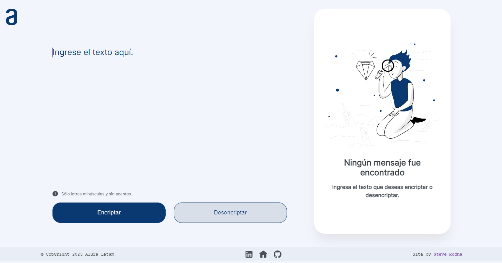

<h1 align="center">:closed_lock_with_key: ENCRIPTADOR DE TEXTOS :closed_lock_with_key:</h1>

## :pencil: DESCRIPCION

El presente proyecto es una **aplicación web que encripta y desencripta texto** de manera fácil y segura para intercambiar mensajes secretos con otras personas que sepan el secreto de la encriptación utilizada. La aplicación web puede convertir una palabra para la versión encriptada y también devolver la misma palabra encriptada para su versión original.

Por ejemplo:
~~~
yo soy one de alura latam  =>  yober sobery obernenter denter ailufatrai laitaim
yober sobery obernenter denter ailufatrai laitaim  =>  yo soy one de alura latam
~~~

Durante el desarrollo de esta aplicación web se trabajó bajo una **Metodología Ágil de Desarrollo** utilizando la herramienta **"Trello"**, para organizar y controlar el progreso de mis actividades.

En el siguiente enlace puede navegar por el tablero del proyecto:  
https://trello.com/b/fxWC8aMf/challenge-one-encriptador-de-texto

## :bulb: ESTRATEGIA DE DESARROLLO

Para realizar la funcionalidad de encriptación y desencriptación se utilizaron *"llaves de encriptación"*, valga la redundancia, junto a ello se *construyeron funciones adicionales* para desarrollar todo el mecanismo y proceso de encriptación, desencriptación, visualización, restricciones y/o condiciones.

Dentro de cada función construída se utilizaron:
- Variables que accesan a nuestros elementos HTML.
- Funciones propias del lenguaje JavaScript, como replace(), test(), split(), etc.
- Condicionales.
- Expresiones regulares.
- Manipulación de eventos.

## :globe_with_meridians: CARACTERISTICAS DE LA APLICACIÓN WEB

- Interfaz sencilla y fácil de usar.
- La página contiene campos para la inserción de texto a encriptar/desencriptar y para la visualización de texto encriptado/desencriptado.
- Ambas funciones de encriptación y desencriptación pueden ser realizadas desde la misma aplicación web en línea.
- Encriptación y desencriptación de texto en tiempo real.
- Opción adicional para "copiar" el texto encriptado/desencriptado directamente desde un botón.
- Compatibilidad con diferentes dispositivos y navegadores, diseño web responsivo.

### CONDICIONES

- Se debe ingresar solo texto con letras minúsculas.
- No deben ser utilizadas letras con acentos ni caracteres especiales.

## :art: DISEÑO

Para el desarrollo de la interfaz de esta aplicación web, se tuvo a disposición una **plantilla en FIGMA** como referencia propuesta por el equipo de diseñadores de **Alura Latam - Programa ONE**, que prepararon para el desarrollo de esta aplicación web.

La aplicación web se ha creado teniendo en cuenta un **diseño adaptativo**, o **responsive**, para diferentes tamaños de pantalla, ya sea para despositivos de escritorio o móviles.

En el siguiente enlace puede visualizar la plantilla en Figma:  
https://www.figma.com/file/C18uAQfrOq4Tk0ZWlVTU0t/Alura-Latam-Challenge---Sprint-%2301?node-id=0%3A1&t=FQGIWtKaCClnO6fL-0

## :computer: TECNOLOGIAS

Las tecnologías utilizadas para hacer posible el desarrollo de esta aplicación web son las siguientes:

- HTML
- CSS
- JavaScript

## :dart: ¿COMO USAR?

- Ingresa el texto que deseas encriptar en el campo de texto proporcionado.
- Haz clic en el botón "Encriptar" para obtener el texto encriptado.
- Para desencriptar, copia el texto encriptado con el botón "Copiar" y pégalo en el campo de texto proporcionado.
- Haz clic en el botón "Desencriptar" para obtener el texto original.
---
# :mag_right: MENSAJE SECRETO

Visita nuestra [aplicación web](https://isteve31.github.io/Encriptador-De-Textos/) en línea y desencripta el mensaje secreto!  
**SUERTE! :four_leaf_clover:**
~~~
lai vimesdai timesenternenter enterl coberloberr cobern enterl qufatenter tufat lai qufatimesenterrais pimesntair

fenterlimescimestaicimesobernenters y mufatchais graicimesais
~~~